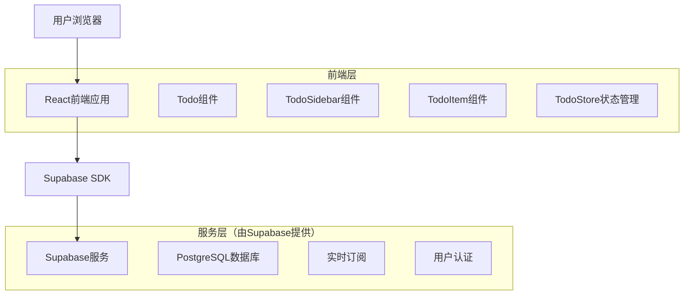
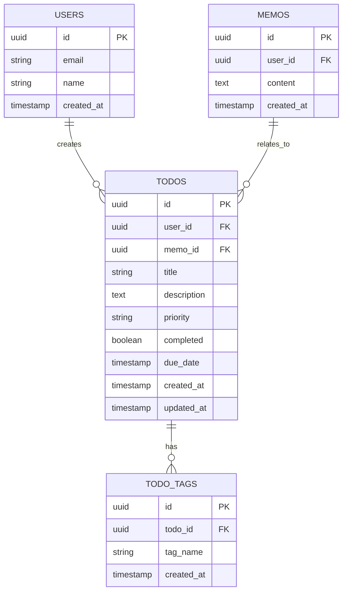

# Todo侧边栏功能技术架构文档

## 1. 架构设计



## 2. 技术描述

* 前端: React\@18 + TypeScript + Tailwind CSS + Vite

* 后端: Supabase（PostgreSQL + 实时功能 + 认证）

* 状态管理: MobX（与现有memos架构保持一致）

* UI组件: 基于现有的shadcn/ui组件库

## 3. 路由定义

| 路由         | 目的                   |
| ---------- | -------------------- |
| /          | 主页面，显示笔记列表和todo侧边栏   |
| /m/:uid    | 笔记详情页，显示笔记内容和todo侧边栏 |
| /todos     | Todo管理页面，提供完整的任务管理功能 |
| /todos/:id | 单个todo项的详细编辑页面       |

## 4. API定义

### 4.1 核心API

Todo相关API（通过Supabase客户端SDK）

**获取用户Todo列表**

```typescript
// 通过Supabase客户端
const { data, error } = await supabase
  .from('todos')
  .select('*')
  .eq('user_id', userId)
  .order('created_at', { ascending: false })
```

**创建Todo项**

```typescript
interface CreateTodoRequest {
  title: string;
  description?: string;
  priority: 'low' | 'medium' | 'high';
  due_date?: string;
  tags?: string[];
  memo_id?: string; // 关联的笔记ID
}

const { data, error } = await supabase
  .from('todos')
  .insert([todoData])
```

**更新Todo状态**

```typescript
interface UpdateTodoRequest {
  id: string;
  completed?: boolean;
  title?: string;
  description?: string;
  priority?: 'low' | 'medium' | 'high';
  due_date?: string;
  tags?: string[];
}

const { data, error } = await supabase
  .from('todos')
  .update(updateData)
  .eq('id', todoId)
```

## 5. 数据模型

### 5.1 数据模型定义



### 5.2 数据定义语言

**Todo表 (todos)**

```sql
-- 创建todos表
CREATE TABLE todos (
    id UUID PRIMARY KEY DEFAULT gen_random_uuid(),
    user_id UUID NOT NULL REFERENCES auth.users(id) ON DELETE CASCADE,
    memo_id UUID REFERENCES memos(id) ON DELETE SET NULL,
    title VARCHAR(255) NOT NULL,
    description TEXT,
    priority VARCHAR(10) DEFAULT 'medium' CHECK (priority IN ('low', 'medium', 'high')),
    completed BOOLEAN DEFAULT FALSE,
    due_date TIMESTAMP WITH TIME ZONE,
    created_at TIMESTAMP WITH TIME ZONE DEFAULT NOW(),
    updated_at TIMESTAMP WITH TIME ZONE DEFAULT NOW()
);

-- 创建索引
CREATE INDEX idx_todos_user_id ON todos(user_id);
CREATE INDEX idx_todos_completed ON todos(completed);
CREATE INDEX idx_todos_due_date ON todos(due_date);
CREATE INDEX idx_todos_memo_id ON todos(memo_id);

-- 创建更新时间触发器
CREATE OR REPLACE FUNCTION update_updated_at_column()
RETURNS TRIGGER AS $$
BEGIN
    NEW.updated_at = NOW();
    RETURN NEW;
END;
$$ language 'plpgsql';

CREATE TRIGGER update_todos_updated_at BEFORE UPDATE ON todos
    FOR EACH ROW EXECUTE FUNCTION update_updated_at_column();
```

**Todo标签表 (todo\_tags)**

```sql
-- 创建todo_tags表
CREATE TABLE todo_tags (
    id UUID PRIMARY KEY DEFAULT gen_random_uuid(),
    todo_id UUID NOT NULL REFERENCES todos(id) ON DELETE CASCADE,
    tag_name VARCHAR(50) NOT NULL,
    created_at TIMESTAMP WITH TIME ZONE DEFAULT NOW(),
    UNIQUE(todo_id, tag_name)
);

-- 创建索引
CREATE INDEX idx_todo_tags_todo_id ON todo_tags(todo_id);
CREATE INDEX idx_todo_tags_name ON todo_tags(tag_name);
```

**权限设置**

```sql
-- 为认证用户设置todos表权限
GRANT SELECT ON todos TO authenticated;
GRANT INSERT ON todos TO authenticated;
GRANT UPDATE ON todos TO authenticated;
GRANT DELETE ON todos TO authenticated;

-- 为认证用户设置todo_tags表权限
GRANT SELECT ON todo_tags TO authenticated;
GRANT INSERT ON todo_tags TO authenticated;
GRANT UPDATE ON todo_tags TO authenticated;
GRANT DELETE ON todo_tags TO authenticated;

-- 行级安全策略
ALTER TABLE todos ENABLE ROW LEVEL SECURITY;
ALTER TABLE todo_tags ENABLE ROW LEVEL SECURITY;

-- 用户只能访问自己的todos
CREATE POLICY "Users can view own todos" ON todos
    FOR SELECT USING (auth.uid() = user_id);

CREATE POLICY "Users can insert own todos" ON todos
    FOR INSERT WITH CHECK (auth.uid() = user_id);

CREATE POLICY "Users can update own todos" ON todos
    FOR UPDATE USING (auth.uid() = user_id);

CREATE POLICY "Users can delete own todos" ON todos
    FOR DELETE USING (auth.uid() = user_id);

-- todo_tags的策略
CREATE POLICY "Users can manage own todo tags" ON todo_tags
    FOR ALL USING (
        EXISTS (
            SELECT 1 FROM todos 
            WHERE todos.id = todo_tags.todo_id 
            AND todos.user_id = auth.uid()
        )
    );
```

**初始化数据**

```sql
-- 插入示例数据（可选）
INSERT INTO todos (user_id, title, description, priority, due_date)
VALUES 
    (auth.uid(), '完成项目文档', '编写技术文档和用户手册', 'high', NOW() + INTERVAL '3 days'),
    (auth.uid(), '代码审查', '审查团队成员提交的代码', 'medium', NOW() + INTERVAL '1 day'),
    (auth.uid(), '学习新技术', '研究React 18的新特性', 'low', NOW() + INTERVAL '1 week');
```

