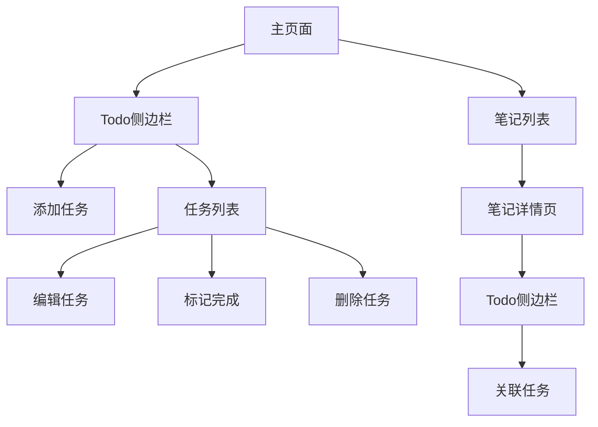

# Memos Todo侧边栏功能产品需求文档

## 1. 产品概述

为memos笔记应用添加一个todo待办事项侧边栏功能，在笔记内容右侧显示个人待办事项列表，提升用户的任务管理和笔记记录的协同效率。

该功能将帮助用户在记录笔记的同时管理日常任务，实现笔记与任务管理的无缝集成，提高工作效率。

## 2. 核心功能

### 2.1 用户角色

| 角色   | 注册方式       | 核心权限                     |
| ---- | ---------- | ------------------------ |
| 普通用户 | 现有memos用户  | 可创建、编辑、删除和管理个人todo事项     |
| 管理员  | 现有memos管理员 | 拥有普通用户所有权限，可查看系统todo使用统计 |

### 2.2 功能模块

我们的todo侧边栏需求包含以下主要页面：

1. **主页面（带todo侧边栏）**: 笔记列表展示、todo侧边栏显示、响应式布局适配
2. **笔记详情页（带todo侧边栏）**: 笔记详细内容、todo侧边栏、任务与笔记关联
3. **todo管理界面**: todo项目的增删改查、状态管理、分类筛选

### 2.3 页面详情

| 页面名称     | 模块名称    | 功能描述                         |
| -------- | ------- | ---------------------------- |
| 主页面      | 笔记列表区域  | 显示用户的笔记列表，保持现有布局和功能          |
| 主页面      | Todo侧边栏 | 在右侧显示待办事项列表，支持快速添加、标记完成、删除操作 |
| 主页面      | 响应式布局   | 在移动端自动隐藏侧边栏，提供切换按钮           |
| 笔记详情页    | 笔记内容区域  | 显示笔记详细内容，保持现有功能              |
| 笔记详情页    | Todo侧边栏 | 显示全局todo列表，支持与当前笔记关联的任务高亮    |
| Todo管理界面 | 任务列表    | 显示所有todo项目，支持按状态、创建时间、优先级筛选  |
| Todo管理界面 | 任务编辑    | 支持编辑任务标题、描述、优先级、截止时间         |
| Todo管理界面 | 任务分类    | 支持为任务添加标签和分类                 |

## 3. 核心流程

**普通用户流程：**
用户进入主页面 → 在右侧todo侧边栏查看待办事项 → 点击添加按钮创建新任务 → 填写任务信息并保存 → 在列表中查看和管理任务 → 标记任务为完成状态 → 删除已完成的任务

**任务与笔记关联流程：**
用户在笔记详情页 → 在todo侧边栏中选择相关任务 → 系统自动关联任务与当前笔记 → 在任务列表中显示关联的笔记链接

## 4. 用户界面设计

### 4.1 设计风格

* **主色调**: 继承memos现有的主题色彩系统（支持深色/浅色模式）

* **按钮样式**: 圆角按钮，与现有UI保持一致

* **字体**: 使用系统默认字体，14px为主要字号，12px为辅助信息字号

* **布局风格**: 卡片式设计，右侧固定宽度侧边栏（280px）

* **图标风格**: 使用Lucide图标库，保持与现有图标风格一致

### 4.2 页面设计概览

| 页面名称     | 模块名称    | UI元素                                          |
| -------- | ------- | --------------------------------------------- |
| 主页面      | Todo侧边栏 | 固定宽度280px，白色/深色背景，圆角卡片容器，顶部添加按钮，任务列表区域，底部统计信息 |
| 主页面      | 任务项     | 复选框、任务标题、优先级标识、截止时间、操作按钮（编辑/删除）               |
| 笔记详情页    | Todo侧边栏 | 与主页面保持一致，增加"关联到当前笔记"功能按钮                      |
| Todo管理界面 | 任务编辑表单  | 标题输入框、描述文本域、优先级选择器、日期选择器、标签输入                 |

### 4.3 响应式设计

* **桌面端**: 主内容区域自适应宽度，右侧固定280px宽度的todo侧边栏

* **平板端**: 侧边栏宽度调整为240px，保持基本功能

* **移动端**: 侧边栏默认隐藏，通过浮动按钮或底部导航访问，支持全屏模式显示todo列表

